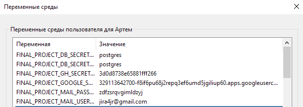
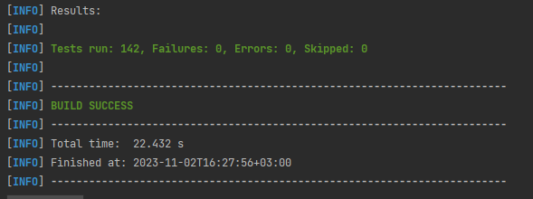
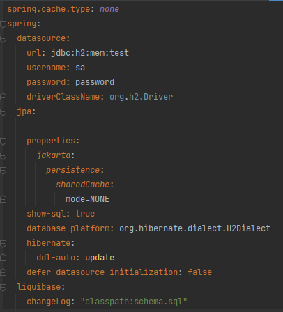
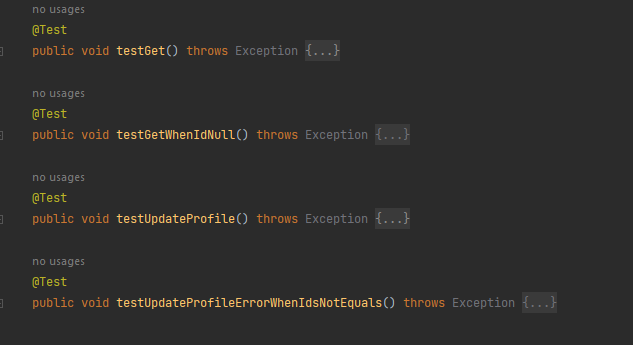
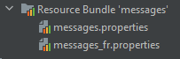
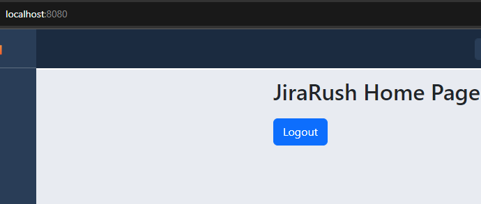
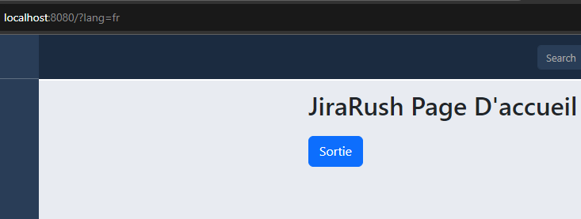

## [REST API](http://localhost:8080/doc)

## Концепция:

- Spring Modulith
    - [Spring Modulith: достигли ли мы зрелости модульности](https://habr.com/ru/post/701984/)
    - [Introducing Spring Modulith](https://spring.io/blog/2022/10/21/introducing-spring-modulith)
    - [Spring Modulith - Reference documentation](https://docs.spring.io/spring-modulith/docs/current-SNAPSHOT/reference/html/)

```
  url: jdbc:postgresql://localhost:5432/jira
  username: jira
  password: JiraRush
```

- Есть 2 общие таблицы, на которых не fk
    - _Reference_ - справочник. Связь делаем по _code_ (по id нельзя, тк id привязано к окружению-конкретной базе)
    - _UserBelong_ - привязка юзеров с типом (owner, lead, ...) к объекту (таска, проект, спринт, ...). FK вручную будем
      проверять

## Аналоги

- https://java-source.net/open-source/issue-trackers

## Тестирование

- https://habr.com/ru/articles/259055/


## Список выполненных задач:
- (1) Разобраться со структурой проекта (onboarding).
-
- 
- 
- (2) Удалить социальные сети: vk, yandex.
```
1. В application.yaml убрал vk&yandex из:
  1.1 security-oauth2-client-registration
  1.2 security-oauth2-client-provider
2. Убрал handler'ы vk&yandex из src/main/java/com/javarush/jira/login/internal/sociallogin/handler:
  2.1 YandexOAuth2UserDataHandler;
  2.2 VkOAuth2UserDataHandler;
3. Убрал кнопки vk&yandex с login.html
4. Убрал кнопки vk&yandex с register.html
```
- 
- 
- 
- (3) Вынести чувствительную информацию в отдельный проперти файл:
- логин
- пароль БД
- идентификаторы для OAuth регистрации/авторизации
- инастройки почты
- Значения этих проперти должны считываться при старте сервера из переменных окружения машины



-
- 
- 
- (4) Переделать тесты так, чтоб во время тестов использовалась in memory БД (H2), а не PostgreSQL. 
- Для этого нужно определить 2 бина, и выборка какой из них использовать должно определяться активным профилем Spring. 
- H2 не поддерживает все фичи, которые есть у PostgreSQL, поэтому тебе придется немного упростить скрипты с тестовыми данными.

``` 
Упростил сложные запросы, например:
    alter table USER_BELONG
    drop constraint FK_USER_BELONG,
    add constraint FK_USER_BELONG foreign key (USER_ID) references USERS (ID) on delete cascade;
упростил в:
alter table USER_BELONG drop constraint FK_USER_BELONG;
alter table USER_BELONG add constraint FK_USER_BELONG foreign key (USER_ID) references USERS (ID) on delete cascade;

Заменил использование зарезервированных слов, например, VALUE.

и т.д.
```




-
-
- 
- (5) Написать тесты для всех публичных методов контроллера ProfileRestController. 
- Хоть методов только 2, но тестовых методов должно быть больше, т.к. нужно проверить success and unsuccess path.
``` 
Написал 4 теста - по два на каждый метод. 2 теста проверяют обычную работу методов, другие 2 метода проверяют - отрабатывают ли exception. 
```

-
- 
- 
- (6)Сделать рефакторинг метода com.javarush.jira.bugtracking.attachment.FileUtil#upload, чтобы он использовал современный подход для работы с файловой системой

```

Было:
        
File dir = new File(directoryPath);
if (dir.exists() || dir.mkdirs()) {
  File file = new File(directoryPath + fileName);
    try (OutputStream outStream = new FileOutputStream(file)) {
      outStream.write(multipartFile.getBytes());
    } catch (IOException ex) {
        throw new IllegalRequestDataException("Failed to upload file" + multipartFile.getOriginalFilename());
    }
}


Стало:
        
Path dir = Paths.get(directoryPath);
try {
     if (Files.exists(dir) || Files.createDirectories(dir) != null) {
        Path filePath = dir.resolve(fileName);
        try (OutputStream outStream = Files.newOutputStream(filePath)) {
          outStream.write(multipartFile.getBytes());
        } catch (IOException ex) {
            throw new IllegalRequestDataException("Failed to upload file" + multipartFile.getOriginalFilename());
        }
     }
} catch (IOException ioException) {
    throw new IllegalRequestDataException("File doesn't exist or failed creation a directory by path : " + dir);
}
```
-
-
-
- (8) Добавить подсчет времени сколько задача находилась в работе и тестировании. 
- Написать 2 метода на уровне сервиса, которые параметром принимают задачу и возвращают затраченное время:
- Сколько задача находилась в работе (ready_for_review минус in_progress). 
- Сколько задача находилась на тестировании (done минус ready_for_review). 
- Для написания этого задания, нужно добавить в конец скрипта инициализации базы данных changelog.sql 3 записи в таблицу ACTIVITY

insert into ACTIVITY ( ID, AUTHOR_ID, TASK_ID, UPDATED, STATUS_CODE ) values ...
Со статусами:
время начала работы над задачей – in_progress
время окончания разработки - ready_for_review
время конца тестирования - done

- Методы:
``` 
public Duration getTimeSpentInProgress(Task task) {
        Activity inProgressActivity = activityHandler.getRepository().findByTaskIdAndStatusCodeOrderByUpdatedDesc(task.getId(), "in_progress");
        Activity readyForReviewActivity = activityHandler.getRepository().findByTaskIdAndStatusCodeOrderByUpdatedDesc(task.getId(), "ready_for_review");

        if (inProgressActivity == null || readyForReviewActivity == null) {
            return Duration.ZERO;
        }

        LocalDateTime inProgressTime = inProgressActivity.getUpdated();
        LocalDateTime readyForReviewTime = readyForReviewActivity.getUpdated();

        return Duration.between(inProgressTime, readyForReviewTime);
    }

    public Duration getTimeSpentInTesting(Task task) {
        Activity readyForReviewActivity = activityHandler.getRepository().findByTaskIdAndStatusCodeOrderByUpdatedDesc(task.getId(), "ready_for_review");
        Activity doneActivity = activityHandler.getRepository().findByTaskIdAndStatusCodeOrderByUpdatedDesc(task.getId(), "done");

        if (readyForReviewActivity == null || doneActivity == null) {
            return Duration.ZERO;
        }

        LocalDateTime readyForReviewTime = readyForReviewActivity.getUpdated();
        LocalDateTime doneTime = doneActivity.getUpdated();

        return Duration.between(readyForReviewTime, doneTime);
    }
```
- changelog:
``` 
--changeset tommy:change_activity_status_code_for_duration_methods
DELETE FROM ACTIVITY;
INSERT INTO ACTIVITY (ID, TASK_ID, AUTHOR_ID, UPDATED, STATUS_CODE)
VALUES (1, 1, 1, CURRENT_TIMESTAMP, 'in_progress');

INSERT INTO ACTIVITY (ID, TASK_ID, AUTHOR_ID, UPDATED, STATUS_CODE)
VALUES (2, 1, 1, CURRENT_TIMESTAMP, 'ready_for_review');

INSERT INTO ACTIVITY (ID, TASK_ID, AUTHOR_ID, UPDATED, STATUS_CODE)
VALUES (3, 1, 1, CURRENT_TIMESTAMP, 'done'); 
```
- 
- 
- 
- (11) Добавить локализацию минимум на двух языках для шаблонов писем (mails) и стартовой страницы index.html.





